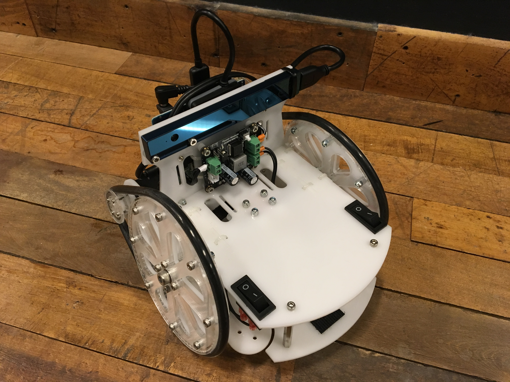

Simple Autonomous Wheeled Robot (SAWR)
======================================

The goal of the SAWR project is to define a basic "example robot" to
demonstrate autonomous navigation using [ROS](http://wiki.ros.org/) with
the [Intel&reg; RealSense&trade; 3D cameras][RS]. This robot can also be
used as a software development and testing platform and to deliver training
material.

This repository contains both the hardware specification and the software
to enable you to build, set up, and run your own SAWR.

Hardware
--------
For compute and sensing, you can use either the 
[Intel&reg; RealSense&trade; Robotic Development Kit][RDK]
(which includes an [Aaeon UP Board][UP] and an
[Intel&reg; RealSense&trade; R200 3D camera][R200]) or an
[Intel&reg; Joule&trade; compute module][Joule] an
Intel&reg; RealSense&trade; R200 3D camera.
The frame can also support a [RealSense&trade; ZR300 3D camera][ZR300],
which has additional capabilities for visual odometry and inertial navigation,
but the SW has not yet been fully updated and tested; stay tuned.

The hardware specification, located in [sawr_hardware](sawr_hardware), is
intended to be sufficient to allow you to build your own SAWR if you have
access to a laser cutter.  A general overview of the hardware design is in
[sawr_hardware/README.md](sawr_hardware/README.md) and assembly details are in
[sawr_hardware/ASSEMBLY.md](sawr_hardware/ASSEMBLY.md).

Software
--------
The SAWR software stack enables basic autonomous navigation and currently
supports building a 2D map with gmapper and then planning and executing a
motion path using move-base. It does not yet support out-of-the-box secure
teleoperation, however. You will have to either run ROS over a network
isolated for security, set up a VPN, or set up your own secure remote
teleoperation interface.  See the [Release Notes](RELEASE.md) for details.
Security updates will be distributed via the [Security Notes](SECURITY.md).
If you want to be updated on security issues with the SAWR please 
watch for updates on that file.

The software stack consists of ROS configuration files and some simple ROS 
nodes for motor control. For the most part, we have kept the stack as simple 
as possible. Additional instructions for the SAWR software stack are located 
in the [sawr_master](sawr_master) package:
* [sawr_master/INSTALL.md](sawr_master/INSTALL.md): 
   How to install the SAWR software stack.
* [sawr_master/LAUNCH.md](sawr_master/LAUNCH.md): 
   How to run the SAWR software stack after installation.

Packages
--------
Here is a list of packages included in this project to provide the software
stack for the SAWR and a summary of what each one contains:
* [sawr_master](sawr_master/README.md):
   Master package, installation instructions, and launch scripts.
* [sawr_description](sawr_description/README.md):
   Run-time physical description (URDF files).
* [sawr_base](sawr_base/README.md):
   Motor controller and hardware interfacing.
* [sawr_scan](sawr_scan/README.md):
   Camera configuration.
* [sawr_mapping](sawr_mapping/README.md):
   SLAM configuration.
* [sawr_navigation](sawr_navigation/README.md):
   Move-base configuration.

For the hardware, CAD files and build instructions are located in the 
following package. It is located in the same repository but is not actually 
required for run-time operation:
* [sawr_hardware](sawr_hardware/README.md):
   CAD files and assembly instructions.

Additional Material
-------------------
Please look for the SAWR project under [01.org](https://01.org/sawr)
for links to additional material. Only basic build instructions 
included in this package.  The 01.org site will contain additional
tutorial information including video, as well as a discussion of future
plans.  This site will also act as a hub pointing to any other resources 
(for instance, under the ROS wiki) as they become available.

In particular, we hope to make kits available for purchase and link to them 
from the [01.org SAWR project page](https://01.org/sawr). If you want to make 
and sell a kit, no problem! The licenses used permit commercial use and 
derivatives; see [LICENSES.md](LICENSES.md) for details of the licenses, 
and the package.xml files in each directory for information on which licenses 
apply to each component. However, please do let us know if you are producing 
a kit so we can link to you from the above site.

Contributing
------------
This project welcomes third-party code via GitHub pull requests. Please review 
the [Contribution License Agreement](CLA.md) located in the root of the 
repository. For each pull request submitted, please state your legal name and 
the text, 
> "I agree to the terms of the 'Simple Autonomous Wheeled Robot' (SAWR) CLA."

[RS]: http://www.intel.com/content/www/us/en/architecture-and-technology/realsense-overview.html
[RDK]: https://software.intel.com/en-us/realsense/robotic-development-kit
[UP]: http://www.up-board.org/ 
[R200]: https://software.intel.com/en-us/articles/realsense-r200-camera
[Joule]: https://software.intel.com/en-us/iot/hardware/joule
[ZR300]: https://click.intel.com/intelr-realsensetm-development-kit-featuring-the-zr300.html
