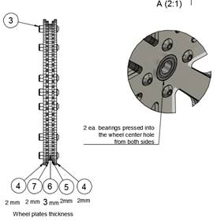

# Simple Autonomous Wheeled Robot (SAWR) Assembly Instructions

The SAWR is a simple learning platform for autonomous robotics. Despite its small size and low cost, it is capable of performing advanced mobile robotics tasks, including simultaneous localization, mapping, and navigation. 

The purpose of the SAWR is to provide a starting point for people who would like to learn more about advanced mobile robotics, in particular autonomous navigation and ROS, the Robot Operating System.

This simple robot (and its software stack) can also serve as a starting point for those seeking to develop more sophisticated robots based on the Intel&reg; RealSense&trade; RDK.

All frame components for the SAWR are parametrically designed with [OpenSCAD](http://www.openscad.org/) and can be easily adjusted to 
accommodate geometry of new electronic components if required. In addition to the Intel&reg; RealSense&trade; RDK, the frame also already has mounting points for the Intel&reg; Joule&trade; development kit and the ZR300 Intel&reg; RealSense&trade; 3D camera.

The SAWR has a simple design and uses a minimal number of easily available off-the-shelf parts, making this platform easy to assemble. This allows you to and move faster into the ROS development phase, rather than spending time on mechanical assembly and custom electronic components. In particular, the SAWR's locomotion is based on two Dynamixel MX-12W servos, which provide accurate odometry feedback and speed control, and are well-supported by ROS and the robotics community.

This document outlines all mechanical/electronic components and assembly steps of the SAWR. Images have been included in the SAWR package to go with this file but links are also provided to high-resolution files and even 3D models as appropriate.

## Mechanical Assembly and Electrical Wiring

All mechanical drawings, 3D assemblies, and electrical schematics presented in this document are also available in the form of web
links to CAD cloud storage. In general, the online versions of these images and models may be more up-to-date than the images in this document, in addition to in many cases allowing interaction, such as rotating the 3D model. Therefore, please follow the links in any case where a clearer view is needed or to ensure you have the latest version of the figure. You can also use OpenSCAD to look at the model locally.

All Fastener specifications and part numbers are provided in the BOM and 2D drawings. Part numbers are from the [McMaster-Carr catalog](http://www.mcmaster.com/).

All fasteners are sized in metric. In many cases equivalent parts can be substituted, so in addition to McMaster-Carr part numbers we also provide (in BOM and drawings) generic specifications of each part so you can find appropriate substitute parts if necessary.

Generally a 10% tolerance is permissable for holes and slots. One exception however where an accurate size is needed is for the bearings and the bolt used for the wheel axle. These must be exact so get metric bolts and bearings or edit the CAD files and/or cut files.

Frame, driver and wheel components are laser cut from two 450mm x 300mm (18x12 in) Acrylic or Acetal sheets: one 2mm thick and the second 3mm thick. Acrylic is perfectly fine and is low-cost, but Acetal (also known as POM, Delrin, or Duracon) is more durable and is recommended for heavy use, such as in a classroom, or if you need to transport the robot frequently. Using Acrylic for the 2mm sheet and Acetal for the 3mm sheet is also possible and gives most of the benefit of using Acetal alone.

If you just want to laser-cut the file, start with the PDF file, being careful not to resize it. If you do not have access to the size
of sheet specified, you can rearrange the parts using a 2D vector graphics editor such as [Inkscape](https://inkscape.org/), which is free. In this case, you want to start from the SVG file. If you need to rearrange the file with Adobe Illustrator, however, start from the PDF file, as Adobe Illustrator tends to resize SVG on import. In addition, the lines in these files have been colored red and blue.  Red lines should be cut first, followed by the blue lines (Trotec conventions). Depending on your laser cutter (i.e. if you have a Universal laser cutter), you may have to modify the colors to get the right cutting order. Depending on the laser cutter model the cut time is between 24 min to 1 hr.

### Sheet 1:450X300x2 mm
(18x12x0.078 in) -- 1 each.

Select Download from the following web pages
  * [Download Laser Cut file for 2mm sheet in SVG format](http://a360.co/2aKxAYn)
  * [Download Laser Cut file for 2mm sheet in PDF format](http://a360.co/2iRK3wz)

### Sheet 2:450x300x3mm
(18X12x0.118in) -- 1 each.

  * [Download Laser Cut file for 3mm sheet in SVG format](http://a360.co/2iRDmuA)
  * [Download Laser Cut file for 3mm sheet in PDF format](http://a360.co/2iRBB0e)

Here is [a drawing](http://a360.co/2a88Qpd) of all laser cut components with the names we will be using to refer to them in the assembly notes.

The Tower plate provides the option to mount either the RDK kit (UP board and Intel RealSense RS200) or an Intel Joule development kit with an Intel RealSense ZR300 camera. Itfs also possible to combine a Joule with an R200 camera.

Here is a Bill of Materials (BOM), with estimated cost of parts. The links are for reference only; you may be able to find alternative suppliers for these parts.

  * [Download BOM (Bill of Materials) in XLS format](http://a360.co/2c8y1bV)
  * [Download BOM (Bill of Materials) in CSV format](http://a360.co/2c8xRBg)

## Wheels Assembly

_Drawing 1_

  * [Drawing 1](http://a360.co/29UsC8R)
  * [Wheel 3D Assembly]("http://a360.co/2agnle2)

Wheels are assembled from five layers of laser cut components. The outer  profile of the wheel has a "U" shape to capture an O-ring tire, which is also used as a belt drive.  The center layer of each wheel is 3mm thick, and all other layers are 2mm thick. The total wheel thickness is 11mm.

  * Press in two bearings into the center holes of two pairs of the outer 2mm 
    wheel layers. This is easiest before bolting the wheel layers together as 
    you can press in the bearing using a flat surface.
  * Secure all 5 layers of the wheel with 12 ea. M3 lock-nuts and M3x14
    screws. The central layerfs hole is slightly smaller than the outer 
    diameter of the bearing, so the bearings will not pass through the center 
    layer.
  * Repeat for the second wheel.

## Frame and assembly of other components

It is advisable to assemble the rest of the robot in the order given below. Note the location of the holes on the top of the tower: the orientation of the tower plate matters, it is not reversible!

  1. Attach components to the Tower plate in the following order: 
     (Drawings 2 A, B, C) 
     [Tower 3D Assembly](http://a360.co/2ago66G)
     
     
     Drawing 2A

  * Attach two brackets to the tower. For each bracket, install
     6ea. M2 hex nuts (provided in servo box) in the bracket and use 6ea.
     M2x8 screws to secure bracket to the Tower. Repeat for the
     second bracket.

       [Drawing2A](http://a360.co/2covpJj)

  * Insert M2 nuts into the servos, both along the outer faces (8 ea.) and 
    along the end where the bracket goes (4 ea.). We will only be
     using the latter for now but it is much easier to install the nuts in the
     servos before mounting them on the robot than afterwards.

  * Attach two servos to the brackets. For each servo, use 4 ea. M2x8
    screws and 4 ea. M2 hex nuts (nuts provided with servo kits)                    [Drawing 2A](http://a360.co/2covpJj)Drawing 2A

    
    
    
    Drawing 2B

  * Install the DFRobot DC-DC Power Convertor.  The power convertor goes on 
    the opposite side of the tower from the servos. Note the orientation of 
    the connectors; when viewed from the side the power converted is mounted
    on, the 5V output should be on the left. When viewed from thegbackh,
    where the servos are, the 5V output will be on the right.
    Use 4ea. M3x6mm spacers, 4ea. M3 locknuts and 4 ea. M3x14 screws/
    Refer to [Drawing 2B](http://a360.co/2coACk9).

  * Install standoffs for the UP board, but do not install UP
     board yet.&nbsp;We will install UP board last after we organize the
     wiring, much of which will run underneath the UP board. Use 4ea M2.5x16 mm
     standoffs and 4ea. M2.5x6 screws. Refer to <a
     href="http://a360.co/2coACk9"><b>Drawing 2B</b></a></li>
</ul>

<a href="http://a360.co/2coACk9"><!--[if gte vml 1]><v:shape id="Picture_x0020_1"
 o:spid="_x0000_i1039" type="#_x0000_t75" style='width:202.5pt;height:231pt;
 visibility:visible;mso-wrap-style:square'>
 <v:imagedata src="INSTRUCTIONS_files/image017.png" o:title=""/>
</v:shape><![endif]--><![if !vml]><![endif]></a><!--[if gte vml 1]><v:shape
 id="Picture_x0020_10" o:spid="_x0000_i1038" type="#_x0000_t75" style='width:219pt;
 height:212.25pt;visibility:visible;mso-wrap-style:square'>
 <v:imagedata src="INSTRUCTIONS_files/image019.png" o:title=""/>
</v:shape><![endif]--><![if !vml]><![endif]>

Drawing 2C 

<o:p>&nbsp;</o:p>

<ul type=disc>
 <li class=MsoNormal style='mso-margin-top-alt:auto;mso-margin-bottom-alt:auto;
     text-align:justify;text-justify:inter-ideograph;line-height:15.75pt;
     mso-list:l9 level1 lfo5;tab-stops:list 36.0pt'>Install the Intel&reg; RealSense&#8482; RS200 3D Camera. Use 2ea
     M3x18 socket head screws, 2 ea. M3 locknuts, 1 ea. sticky magnet (included
     in camera kit) and 1 ea. cable tie. Use 4ea. (2ea. per screw) M3x1mm
     washers as a spacers between camera and Tower.&nbsp;Refer to <a
     href="http://a360.co/2afYBTa"><b>Drawing 2C</b></a><b><u>.&nbsp;</u></b> The following procedure is recommended
     to install the camera in order to ensure precise horizontal and vertical
     alignment :</li>
</ul>

<ol start=1 type=1>
 <li class=MsoNormal style='color:#272727;mso-margin-top-alt:auto;mso-margin-bottom-alt:
     auto;text-align:justify;text-justify:inter-ideograph;line-height:15.75pt;
     mso-list:l3 level1 lfo6;tab-stops:list 36.0pt'>Insert
     1ea. M3x18 screw&nbsp;into slot in camera.<o:p></o:p></li>
 <li class=MsoNormal style='color:#272727;mso-margin-top-alt:auto;mso-margin-bottom-alt:
     auto;text-align:justify;text-justify:inter-ideograph;line-height:15.75pt;
     mso-list:l3 level1 lfo6;tab-stops:list 36.0pt'>Add
     2 ea. M3x1mm washers to the screw between camera and Tower.<o:p></o:p></li>
 <li class=MsoNormal style='mso-margin-top-alt:auto;mso-margin-bottom-alt:auto;
     text-align:justify;text-justify:inter-ideograph;line-height:15.75pt;
     mso-list:l3 level1 lfo6;tab-stops:list 36.0pt'>Loosely secure screw with M3 locknut in the outer camera
     mount hole in the tower.&nbsp;&nbsp;
     The camera should still be able to rotate and slide freely.</li>
 <li class=MsoNormal style='color:#272727;mso-margin-top-alt:auto;mso-margin-bottom-alt:
     auto;text-align:justify;text-justify:inter-ideograph;line-height:15.75pt;
     mso-list:l3 level1 lfo6;tab-stops:list 36.0pt'>Attach
     the magnet to the other side of the camera, making sure it is in an
     accurate position (the bump in the magnet should be in the slot on the
     back of the camera) and remove protective paper from the magnet.<o:p></o:p></li>
 <li class=MsoNormal style='mso-margin-top-alt:auto;mso-margin-bottom-alt:auto;
     text-align:justify;text-justify:inter-ideograph;line-height:15.75pt;
     mso-list:l3 level1 lfo6;tab-stops:list 36.0pt'>Align camera vertically and horizontally&nbsp;- top edge of
     the camera should be aligned with the tower edge.</li>
 <li class=MsoNormal style='color:#272727;mso-margin-top-alt:auto;mso-margin-bottom-alt:
     auto;text-align:justify;text-justify:inter-ideograph;line-height:15.75pt;
     mso-list:l3 level1 lfo6;tab-stops:list 36.0pt'>Attach
     sticky side of the magnet to tower.<o:p></o:p></li>
 <li class=MsoNormal style='color:#272727;mso-margin-top-alt:auto;mso-margin-bottom-alt:
     auto;text-align:justify;text-justify:inter-ideograph;line-height:15.75pt;
     mso-list:l3 level1 lfo6;tab-stops:list 36.0pt'>Secure
     the locknut.<o:p></o:p></li>
 <li class=MsoNormal style='color:#272727;mso-margin-top-alt:auto;mso-margin-bottom-alt:
     auto;text-align:justify;text-justify:inter-ideograph;line-height:15.75pt;
     mso-list:l3 level1 lfo6;tab-stops:list 36.0pt'>Secure
     the second screw with washers and a locknut<o:p></o:p></li>
</ol>

Do not overtighten either screw.&nbsp;&nbsp; The locknuts and screws should
hold the camera firmly without bending the case.&nbsp;<o:p></o:p>

2. &nbsp; Top Plate<b>&nbsp;(Drawing
3A, B, C)</b><o:p></o:p>

<b>&nbsp;&nbsp;&nbsp;&nbsp;&nbsp;&nbsp;&nbsp;&nbsp;</b><a
href="http://a360.co/2a3N9qc"><b>Top 3D Assembly</b></a>

<b><u><o:p>&nbsp;</o:p></u></b>

<o:p>&nbsp;</o:p>

<!--[if gte vml 1]><v:shape
 id="Picture_x0020_22" o:spid="_x0000_i1037" type="#_x0000_t75" style='width:423pt;
 height:192pt;visibility:visible;mso-wrap-style:square'>
 <v:imagedata src="INSTRUCTIONS_files/image021.png" o:title=""/>
</v:shape><![endif]--><![if !vml]><![endif]>

Drawing 3A <o:p></o:p>

<ul type=disc>
 <li class=MsoNormal style='mso-margin-top-alt:auto;mso-margin-bottom-alt:auto;
     line-height:15.75pt;mso-list:l10 level1 lfo7;tab-stops:list 36.0pt'>Attach 2 ea.&nbsp;Inner Mount
     Plates&nbsp;to the Top Plate and secure with 2 ties. Leave ties semi
     loose. Donft cut ties excess length yet. Refer to <a
     href="http://a360.co/2a3nbTS"><b>Drawing 3A</b></a><b>.</b></li>
 <li class=MsoNormal style='mso-margin-top-alt:auto;mso-margin-bottom-alt:auto;
     line-height:15.75pt;mso-list:l10 level1 lfo7;tab-stops:list 36.0pt'>Install 2 ea. Power On-Off
     switches.&nbsp;Refer to <a href="http://a360.co/2a3nbTS"><b>Drawing 3A</b></a><b>.</b></li>
</ul>

<!--[if gte vml 1]><v:shape id="Picture_x0020_23" o:spid="_x0000_i1036"
 type="#_x0000_t75" style='width:372pt;height:218.25pt;visibility:visible;
 mso-wrap-style:square'>
 <v:imagedata src="INSTRUCTIONS_files/image023.png" o:title=""/>
</v:shape><![endif]--><![if !vml]><![endif]>

Drawing 3B <o:p></o:p>

<ul type=disc>
 <li class=MsoNormal style='mso-margin-top-alt:auto;mso-margin-bottom-alt:auto;
     text-align:justify;text-justify:inter-ideograph;line-height:15.75pt;
     mso-list:l10 level1 lfo7;tab-stops:list 36.0pt'>Attach Top Plate to the Tower with 2 ea. M3x6 screws,
     M3nuts, M3x1 washers in T-slots. Tighten ties and cut off excess of tiesf
     length. Refer to <a href="http://a360.co/2a3n1Mc"><b>Drawing 3B</b></a><b>.</b></li>
 <li class=MsoNormal style='mso-margin-top-alt:auto;mso-margin-bottom-alt:auto;
     text-align:justify;text-justify:inter-ideograph;line-height:15.75pt;
     mso-list:l10 level1 lfo7;tab-stops:list 36.0pt'>Install 2 ea. M3x51mm standoffs. Use 2ea. M3x8 button head
     screws.&nbsp;Refer to <a href="http://a360.co/2a3n1Mc"><b>Drawing 3B</b></a><b>.</b></li>
 <li class=MsoNormal style='color:#272727;mso-margin-top-alt:auto;mso-margin-bottom-alt:
     auto;text-align:justify;text-justify:inter-ideograph;line-height:15.75pt;
     mso-list:l10 level1 lfo7;tab-stops:list 36.0pt'>Secure
     Outer Mount Plate to the Servo with 8ea. M2x8&nbsp;screws and 8ea. M2 hex
     nuts<b>.&nbsp;</b>Repeat for the second Outer Mount. <o:p></o:p></li>
</ul>

<!--[if gte vml 1]><v:shape id="Picture_x0020_31" o:spid="_x0000_i1035"
 type="#_x0000_t75" style='width:404.25pt;height:235.5pt;visibility:visible;
 mso-wrap-style:square'>
 <v:imagedata src="INSTRUCTIONS_files/image025.png" o:title=""/>
</v:shape><![endif]--><![if !vml]><![endif]>

Drawing 3C <o:p></o:p>

<ul type=disc>
 <li class=MsoNormal style='mso-margin-top-alt:auto;mso-margin-bottom-alt:auto;
     line-height:15.75pt;mso-list:l10 level1 lfo7;tab-stops:list 36.0pt'>Attach Outer Mount Plates to Top Plate
     with ties. Refer to <a href="http://a360.co/2a3orGD"><b>Drawing 3C</b></a><b>.&nbsp;
     </b></li>
</ul>

<!--[if gte vml 1]><v:shape id="Picture_x0020_32" o:spid="_x0000_i1034"
 type="#_x0000_t75" style='width:192pt;height:184.5pt;visibility:visible;
 mso-wrap-style:square'>
 <v:imagedata src="INSTRUCTIONS_files/image027.png" o:title=""/>
</v:shape><![endif]--><![if !vml]><![endif]><!--[if gte vml 1]><v:shape
 id="Picture_x0020_33" o:spid="_x0000_i1033" type="#_x0000_t75" style='width:228.75pt;
 height:233.25pt;visibility:visible;mso-wrap-style:square'>
 <v:imagedata src="INSTRUCTIONS_files/image029.png" o:title=""/>
</v:shape><![endif]--><![if !vml]><![endif]>

Drawing 4 <o:p></o:p>

&nbsp;&nbsp; 3.&nbsp; Install axles and
Wheels, (<a href="http://a360.co/2a3nPRi"><b>Drawing 4</b></a><b>,&nbsp;&nbsp;</b><a
href="http://a360.co/2a3N1Y2"><b>3D Assembly</b></a><b>)</b>&nbsp;but do not secure the M5 axle nut tightly yet. Repeat for
the second Wheel.&nbsp;&nbsp; NOTE: it is
possible to substitute an M6 nut and bolt for the shoulder bolt used here, as
long as at least 12mm of the shaft of the bolt is unthreaded and is actually
6mm in diameter.

<b>At this point, for the ease of future
assembly, it is advisable to address Servo wiring&nbsp;as described in Servo
Wiring section below.</b><o:p></o:p>

&nbsp;<o:p></o:p>

4. Base Plate<b>&nbsp;(Drawings
5A, B)</b><o:p></o:p>

<b>&nbsp;&nbsp;&nbsp;&nbsp;&nbsp;&nbsp;</b><a
href="http://a360.co/2agoFxm"><b>Base 3D Assembly</b></a>

<b><u><o:p>&nbsp;</o:p></u></b>

<!--[if gte vml 1]><v:shape id="Picture_x0020_34" o:spid="_x0000_i1032"
 type="#_x0000_t75" style='width:363.75pt;height:179.25pt;visibility:visible;
 mso-wrap-style:square'>
 <v:imagedata src="INSTRUCTIONS_files/image031.png" o:title=""/>
</v:shape><![endif]--><![if !vml]><![endif]>

Drawing 5A <o:p></o:p>

<ul type=disc>
 <li class=MsoNormal style='mso-margin-top-alt:auto;mso-margin-bottom-alt:auto;
     text-align:justify;text-justify:inter-ideograph;line-height:15.75pt;
     mso-list:l6 level1 lfo8;tab-stops:list 36.0pt'>Install the ball caster on the Base plate with 3ea.
     M3x8&nbsp;screws and 3ea. M3 locknuts. . Current design uses only one
     caster in the rear part of the robot, but you may add 2 more front casters
     if you want; this will reduce the ability of the robot to go over
     obstacles but will also make it less liable to tipping forward when
     decelerating. The extra mounting holes on the front of the Base plate
     provide this option.&nbsp;Refer to <a href="http://a360.co/2a3zOys"><b>Drawing 5A</b></a><b>. </b><b>&nbsp;Note also that
     only the Acetal version of the base plate have
     flexible gsuspensionsh for the casters.&nbsp; If cut in Acrylic these have proven
     to break too easily.&nbsp;&nbsp; </b>The frame is
     intentionally designed so that the casters do not all touch the ground at
     the same time in any case.</li>
</ul>

&nbsp;&nbsp;&nbsp;&nbsp;&nbsp;&nbsp;&nbsp;&nbsp;&nbsp;&nbsp;&nbsp;&nbsp;&nbsp;&nbsp;&nbsp;&nbsp;&nbsp;&nbsp;&nbsp;&nbsp;&nbsp;&nbsp;&nbsp;&nbsp;&nbsp;&nbsp;&nbsp;&nbsp;&nbsp;&nbsp;&nbsp;&nbsp;&nbsp;&nbsp;&nbsp;&nbsp;&nbsp;&nbsp;&nbsp;&nbsp;&nbsp;&nbsp;&nbsp;&nbsp;&nbsp;&nbsp;&nbsp;
<!--[if gte vml 1]><v:shape id="Picture_x0020_35" o:spid="_x0000_i1031"
 type="#_x0000_t75" style='width:469.5pt;height:315pt;visibility:visible;
 mso-wrap-style:square'>
 <v:imagedata src="INSTRUCTIONS_files/image033.png" o:title=""/>
</v:shape><![endif]--><![if !vml]><![endif]>

Drawing 7 <o:p></o:p>

<ul type=disc>
 <li class=MsoNormal style='mso-margin-top-alt:auto;mso-margin-bottom-alt:auto;
     line-height:15.75pt;mso-list:l6 level1 lfo8;tab-stops:list 36.0pt'>&nbsp;Insert Velcro straps in the slots
     of the Base Plate and Install the Battery. Refer to <a
     href="http://a360.co/2a88AGJ"><b>Drawing 7</b></a><b>.&nbsp;
     </b></li>
 <li class=MsoNormal style='mso-margin-top-alt:auto;mso-margin-bottom-alt:auto;
     line-height:15.75pt;mso-list:l6 level1 lfo8;tab-stops:list 36.0pt'>You should remove the battery
     after fitting it, then add it back in afterwards.<o:p></o:p></li>
</ul>

&nbsp;&nbsp;&nbsp;&nbsp;&nbsp;&nbsp;&nbsp;&nbsp;&nbsp;&nbsp;&nbsp;&nbsp;&nbsp;&nbsp;&nbsp;&nbsp;&nbsp;&nbsp;&nbsp;&nbsp;&nbsp;
<!--[if gte vml 1]><v:shape id="Picture_x0020_36" o:spid="_x0000_i1030"
 type="#_x0000_t75" style='width:340.5pt;height:229.5pt;visibility:visible;
 mso-wrap-style:square'>
 <v:imagedata src="INSTRUCTIONS_files/image035.png" o:title=""/>
</v:shape><![endif]--><![if !vml]><![endif]>

Drawing 5B <o:p></o:p>

<ul type=disc>
 <li class=MsoNormal style='mso-margin-top-alt:auto;mso-margin-bottom-alt:auto;
     line-height:15.75pt;mso-list:l6 level1 lfo8;tab-stops:list 36.0pt'>Secure front Standoffs to the Base Plate
     with 2 ea. M3x8 screws&nbsp;<a href="http://a360.co/2a3zYpA"><b>Drawing 5B</b></a></li>
 <li class=MsoNormal style='mso-margin-top-alt:auto;mso-margin-bottom-alt:auto;
     line-height:15.75pt;mso-list:l6 level1 lfo8;tab-stops:list 36.0pt'>Attach Base Plate to the Tower and secure
     it with 2ea. M3x6screws, 3ea. M3 nuts, and 3ea. M3x1mm washers in T-slots.
     Refer to <a href="http://a360.co/2a3zYpA"><b>Drawing 5B</b></a></li>
 <li class=MsoNormal style='mso-margin-top-alt:auto;mso-margin-bottom-alt:auto;
     line-height:15.75pt;mso-list:l6 level1 lfo8;tab-stops:list 36.0pt'>Secure Outer and Inner Mount Plates to
     the Base Plate with ties. (On both sides).&nbsp;Refer to <a
     href="http://a360.co/2a3zYpA"><b>Drawing 5B</b></a></li>
 <li class=MsoNormal style='mso-margin-top-alt:auto;mso-margin-bottom-alt:auto;
     line-height:15.75pt;mso-list:l6 level1 lfo8;tab-stops:list 36.0pt'>Tighten Axel bolt with a wrench. Do not
     overtighten. Check that Wheels rotate freely on the Axel.&nbsp;Refer to <a
     href="http://a360.co/2a3zYpA"><b>Drawing 5B</b></a><u>.</u></li>
</ul>

&nbsp;&nbsp; 5.
Install driver and O-rings. (<b>Drawings 6 A, B)</b><o:p></o:p>

&nbsp;&nbsp;&nbsp;&nbsp;<a
href="http://a360.co/2a82vKJ">&nbsp;</a><a href="http://a360.co/2akV7Pf"><b>Driver and O-Ring
installation 3D</b></a>

<b><u><o:p>&nbsp;</o:p></u></b>

&nbsp;&nbsp;&nbsp;&nbsp;&nbsp;&nbsp;&nbsp;&nbsp;&nbsp;&nbsp;&nbsp;&nbsp;&nbsp;&nbsp;&nbsp;&nbsp;&nbsp;&nbsp;&nbsp;&nbsp;&nbsp;&nbsp;&nbsp;&nbsp;&nbsp;&nbsp;&nbsp;&nbsp;&nbsp;&nbsp;&nbsp;&nbsp;
<!--[if gte vml 1]><v:shape id="Picture_x0020_37" o:spid="_x0000_i1029"
 type="#_x0000_t75" style='width:227.25pt;height:163.5pt;visibility:visible;
 mso-wrap-style:square'>
 <v:imagedata src="INSTRUCTIONS_files/image037.png" o:title=""/>
</v:shape><![endif]--><![if !vml]><![endif]>

Drawing 6A <o:p></o:p>

<ul type=disc>
 <li class=MsoNormal style='mso-margin-top-alt:auto;mso-margin-bottom-alt:auto;
     line-height:15.75pt;mso-list:l0 level1 lfo9;tab-stops:list 36.0pt'>Assemble driver from Driver components in
     your hand. Parts will be loose.&nbsp;<a
     href="http://a360.co/2a813Yx"><b>Drawing 6A</b></a><b><u>&nbsp;
     </u></b>Using&nbsp;&nbsp;
     4 ea. M2x20mm screws secure driver on the servo hub.</li>
</ul>

<o:p>&nbsp;</o:p>

<!--[if gte vml 1]><v:shape id="Picture_x0020_38" o:spid="_x0000_i1028"
 type="#_x0000_t75" style='width:398.25pt;height:276.75pt;visibility:visible;
 mso-wrap-style:square'>
 <v:imagedata src="INSTRUCTIONS_files/image039.png" o:title=""/>
</v:shape><![endif]--><![if !vml]><![endif]>

Drawing 6B <o:p></o:p>

<![if !supportLists]>&middot;&nbsp;&nbsp;&nbsp;&nbsp;&nbsp;&nbsp;&nbsp;&nbsp;
<![endif]><b>I</b>nstall Driver and O-Ring.&nbsp;<a
href="http://a360.co/2akV0mX"><b>Drawing 6B</b></a> by placing O-Ring
over the Driver and then snapping it into the grooves on the Wheel.

6.&nbsp;&nbsp;<a
href="http://a360.co/2akZt8Y"><b>3DAssembly&nbsp;with battery installed</b></a>

<b> 
</b>

<b><o:p>&nbsp;</o:p></b>

<h1>Wiring Components</h1>

<o:p>&nbsp;</o:p>

<!--[if gte vml 1]><v:shape id="Picture_x0020_24" o:spid="_x0000_i1027"
 type="#_x0000_t75" style='width:303pt;height:234.75pt;visibility:visible;
 mso-wrap-style:square'>
 <v:imagedata src="INSTRUCTIONS_files/image041.png" o:title=""/>
</v:shape><![endif]--><![if !vml]><![endif]><o:p></o:p>

1. Electrical power supply.&nbsp;<a
href="http://a360.co/2a8p4yC"><b>Power Supply diagram</b></a>

In this design we are using&nbsp;Venom 20C 3S
4000mAh 11.1V LiPo Battery with Universal Plug. In
our tests this battery provides enough power for 60 min of robot's
operation.&nbsp;<o:p></o:p>

Main electrical power is distributed from the
battery through an in-line 5 AMP fuse.&nbsp;&nbsp; The positive side is routed
through the main power rocker switch to the DC-DC convertor, where it splits
into 5V and 12V supply lines. The 12V line&nbsp;is used to power the Servos using
a modified Dynamixel cable while the 5V line is used
to power UP board with a barrel connector.<o:p></o:p>

Pay special attention to the correct polarity
of the wires when connecting to DC-DC convertor.&nbsp; If you get this wrong you can destroy
your UP Board and/or your servos.&nbsp;&nbsp;
It is <b>strongly</b> recommended to use a voltmeter to check both the
output voltage and the polarity before plugging in the servos or the UP
Board!&nbsp;(see <a
href="http://www.dfrobot.com/index.php?route=product/product&amp;product_id=752#.V5etZTU2eXg">Manufacturer
instructions</a><u>).</u>

<b>Also be careful when
wiring up the power from the battery.&nbsp;
We know of at least one person that has completely destroyed a robot by
wiring up their battery backwards.</b>

<o:p>&nbsp;</o:p>

2. Servo Wiring (For
the ease of assembly it is advisable to complete this step after step 3 of the
mechanical assembly)<o:p></o:p>

<o:p>&nbsp;</o:p>

<o:p>&nbsp;</o:p>

&nbsp;&nbsp;&nbsp;&nbsp;&nbsp;&nbsp;&nbsp;&nbsp;&nbsp;&nbsp;&nbsp;&nbsp;&nbsp;&nbsp;&nbsp;&nbsp;&nbsp;&nbsp;&nbsp;&nbsp;&nbsp;&nbsp;&nbsp;
<!--[if gte vml 1]><v:shape
 id="Picture_x0020_25" o:spid="_x0000_i1026" type="#_x0000_t75" style='width:321.75pt;
 height:211.5pt;visibility:visible;mso-wrap-style:square'>
 <v:imagedata src="INSTRUCTIONS_files/image043.png" o:title=""/>
</v:shape><![endif]--><![if !vml]><![endif]><o:p></o:p>

<o:p>&nbsp;</o:p>

<ul type=disc>
 <li class=MsoNormal style='mso-margin-top-alt:auto;mso-margin-bottom-alt:auto;
     text-align:justify;text-justify:inter-ideograph;line-height:15.75pt;
     mso-list:l8 level1 lfo10;tab-stops:list 36.0pt'><a
     href="http://a360.co/2a8p5CN"><b>Servo wiring Diagram</b></a></li>
 <li class=MsoNormal style='color:#272727;mso-margin-top-alt:auto;mso-margin-bottom-alt:
     auto;text-align:justify;text-justify:inter-ideograph;line-height:15.75pt;
     mso-list:l8 level1 lfo10;tab-stops:list 36.0pt'>Connect
     USB2AX to 1st servo using a 250mm Dynamixel
     cable.<o:p></o:p></li>
 <li class=MsoNormal style='color:#272727;mso-margin-top-alt:auto;mso-margin-bottom-alt:
     auto;text-align:justify;text-justify:inter-ideograph;line-height:15.75pt;
     mso-list:l8 level1 lfo10;tab-stops:list 36.0pt'>Interconnect
     both servos with Dynamixel 100mm cable<o:p></o:p></li>
 <li class=MsoNormal style='mso-margin-top-alt:auto;mso-margin-bottom-alt:auto;
     text-align:justify;text-justify:inter-ideograph;line-height:15.75pt;
     mso-list:l8 level1 lfo10;tab-stops:list 36.0pt'>Using gcustomh cable, connect the 2nd servo to pass-through
     power connector of DC-DC power convertor.&nbsp; This cable can be created by
     modifying a normal Dynamixel cable.&nbsp; Pay attention to the polarity of
     wires.&nbsp;<u>The gredh wire (the center wire of the Dynamixel
     cable) connects to OV out on the DC-DC convertor and the gblackh wire
     connects to GND</u>. See wiring diagram, and note especially the keying on
     the Dynamixel cables.&nbsp; Unfortunately you will have to use
     the connector keying to distinguish the ground and the signal cables since
     they are not actually colored or labelled in any way.</li>
 <li class=MsoNormal style='mso-margin-top-alt:auto;mso-margin-bottom-alt:auto;
     text-align:justify;text-justify:inter-ideograph;line-height:15.75pt;
     mso-list:l8 level1 lfo10;tab-stops:list 36.0pt'>The gredh wire of the custom cable has 2 female connectors
     that should be attached to the second rocker switch. This rocker switch
     will control power supply to motors only, which will allow you to turn off
     motors, but keep the UP board powered. This is useful both to preserve
     battery life when you need to work on UP board configuration and
     programming, and to stop or reset the motors if necessary without crashing
     the UP Board.</li>
</ul>

3. Camera and UP
Board.<o:p></o:p>

<o:p>&nbsp;</o:p>

&nbsp;&nbsp;&nbsp;&nbsp;&nbsp;&nbsp;&nbsp;&nbsp;&nbsp;&nbsp;&nbsp;&nbsp;&nbsp;&nbsp;&nbsp;&nbsp;&nbsp;&nbsp;&nbsp;&nbsp;&nbsp;
<!--[if gte vml 1]><v:shape id="Picture_x0020_28" o:spid="_x0000_i1025"
 type="#_x0000_t75" style='width:330.75pt;height:218.25pt;visibility:visible;
 mso-wrap-style:square'>
 <v:imagedata src="INSTRUCTIONS_files/image045.png" o:title=""/>
</v:shape><![endif]--><![if !vml]><![endif]>&nbsp;&nbsp;&nbsp;&nbsp;&nbsp;&nbsp;&nbsp;&nbsp;&nbsp;&nbsp;&nbsp;&nbsp;&nbsp;&nbsp;&nbsp;&nbsp;&nbsp;&nbsp;<o:p></o:p>

<ul type=disc>
 <li class=MsoNormal style='mso-margin-top-alt:auto;mso-margin-bottom-alt:auto;
     text-align:justify;text-justify:inter-ideograph;line-height:15.75pt;
     mso-list:l4 level1 lfo11;tab-stops:list 36.0pt'><a
     href="http://a360.co/2ci6REp">Connection Diagram</a></li>
 <li class=MsoNormal style='color:#272727;mso-margin-top-alt:auto;mso-margin-bottom-alt:
     auto;text-align:justify;text-justify:inter-ideograph;line-height:15.75pt;
     mso-list:l4 level1 lfo11;tab-stops:list 36.0pt'>Connect
     RealSense R200 Camera to USB3 OTG port with the USB 3.0 cable provided in
     the camera kit.<o:p></o:p></li>
 <li class=MsoNormal style='color:#272727;mso-margin-top-alt:auto;mso-margin-bottom-alt:
     auto;text-align:justify;text-justify:inter-ideograph;line-height:15.75pt;
     mso-list:l4 level1 lfo11;tab-stops:list 36.0pt'>Plug
     in USB2AX adapter&nbsp;into USB2 port of the UP Board.<o:p></o:p></li>
 <li class=MsoNormal style='mso-margin-top-alt:auto;mso-margin-bottom-alt:auto;
     text-align:justify;text-justify:inter-ideograph;line-height:15.75pt;
     mso-list:l4 level1 lfo11;tab-stops:list 36.0pt'>It is advisable to route camera's&nbsp;and USB2AX cables
     between Tower and UP Board. Address cable management and secure UP Board to
     the Tower plate with 4ea. M2.5x6 screws. <a
     href="http://a360.co/2ajdTqA">Drawing 8</a></li>
 <li class=MsoNormal style='color:#272727;mso-margin-top-alt:auto;mso-margin-bottom-alt:
     auto;text-align:justify;text-justify:inter-ideograph;line-height:15.75pt;
     mso-list:l4 level1 lfo11;tab-stops:list 36.0pt'>Insert
     Wi-Fi USB dongle in UP board<o:p></o:p></li>
</ul>

This section completes
Mechanical and Wiring assembly of SAWR.<o:p></o:p>

<o:p>&nbsp;</o:p>

</body>

</html>
