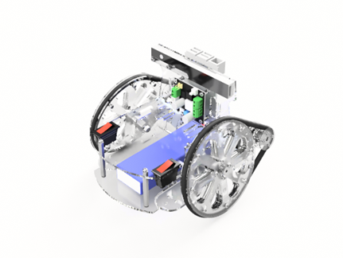
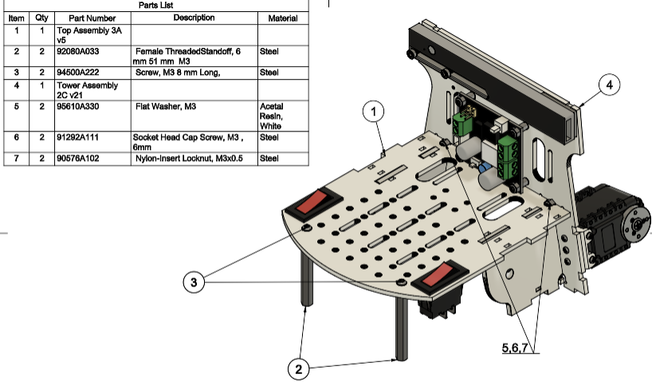
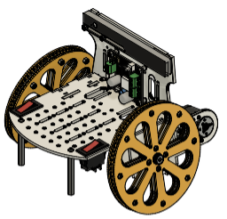
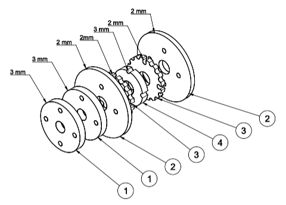
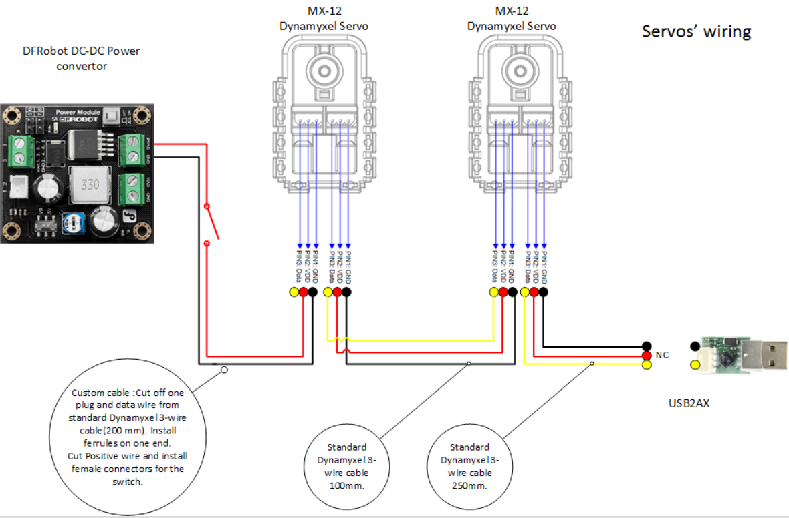
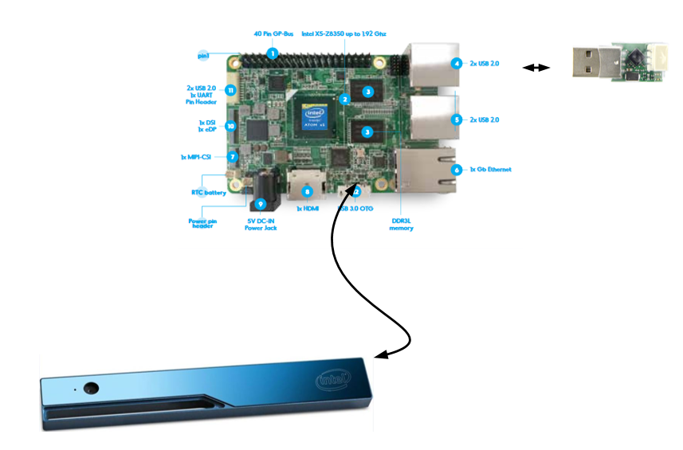

# Simple Autonomous Wheeled Robot (SAWR) Assembly Instructions

The SAWR is a simple learning platform for autonomous robotics. Despite its small size and low cost, it is capable of performing advanced mobile robotics tasks, including simultaneous localization, mapping, and navigation. 

The purpose of the SAWR is to provide a starting point for people who would like to learn more about advanced mobile robotics, in particular autonomous navigation and ROS, the Robot Operating System.

This simple robot (and its software stack) can also serve as a starting point for those seeking to develop more sophisticated robots based on the Intel&reg; RealSense&trade; RDK.

All frame components for the SAWR are parametrically designed with [OpenSCAD](http://www.openscad.org/) and can be easily adjusted to 
accommodate geometry of new electronic components if required. In addition to the Intel&reg; RealSense&trade; RDK, the frame also already has mounting points for the Intel&reg; Joule&trade; development kit and the ZR300 Intel&reg; RealSense&trade; 3D camera.

The SAWR has a simple design and uses a minimal number of easily available off-the-shelf parts, making this platform easy to assemble. This allows you to and move faster into the ROS development phase, rather than spending time on mechanical assembly and custom electronic components. In particular, the SAWR's locomotion is based on two Dynamixel MX-12W servos, which provide accurate odometry feedback and speed control, and are well-supported by ROS and the robotics community.

This document outlines all mechanical/electronic components and assembly steps of the SAWR. Images have been included in the SAWR package to go with this file but links are also provided to high-resolution files and even 3D models as appropriate.

## Mechanical Assembly and Electrical Wiring

All mechanical drawings, 3D assemblies, and electrical schematics presented in this document are also available in the form of web
links to CAD cloud storage. In general, the online versions of these images and models may be more up-to-date than the images in this document, in addition to in many cases allowing interaction, such as rotating the 3D model. Therefore, please follow the links in any case where a clearer view is needed or to ensure you have the latest version of the figure. You can also use OpenSCAD to look at the model locally.

All Fastener specifications and part numbers are provided in the BOM and 2D drawings. Part numbers are from the [McMaster-Carr catalog](http://www.mcmaster.com/).

All fasteners are sized in metric. In many cases equivalent parts can be substituted, so in addition to McMaster-Carr part numbers we also provide (in BOM and drawings) generic specifications of each part so you can find appropriate substitute parts if necessary.

Generally a 10% tolerance is permissable for holes and slots. One exception however where an accurate size is needed is for the bearings and the bolt used for the wheel axle. These must be exact so get metric bolts and bearings or edit the CAD files and/or cut files.

Frame, driver and wheel components are laser cut from two 450mm x 300mm (18x12 in) Acrylic or Acetal sheets: one 2mm thick and the second 3mm thick. Acrylic is perfectly fine and is low-cost, but Acetal (also known as POM, Delrin, or Duracon) is more durable and is recommended for heavy use, such as in a classroom, or if you need to transport the robot frequently. Using Acrylic for the 2mm sheet and Acetal for the 3mm sheet is also possible and gives most of the benefit of using Acetal alone.

If you just want to laser-cut the file, start with the PDF file, being careful not to resize it. If you do not have access to the size
of sheet specified, you can rearrange the parts using a 2D vector graphics editor such as [Inkscape](https://inkscape.org/), which is free. In this case, you want to start from the SVG file. If you need to rearrange the file with Adobe Illustrator, however, start from the PDF file, as Adobe Illustrator tends to resize SVG on import. In addition, the lines in these files have been colored red and blue.  Red lines should be cut first, followed by the blue lines (Trotec conventions). Depending on your laser cutter (i.e. if you have a Universal laser cutter), you may have to modify the colors to get the right cutting order. Depending on the laser cutter model the cut time is between 24 min to 1 hr.

### Sheet 1:450X300x2 mm
(18x12x0.078 in) -- 1 each.

Select Download from the following web pages
  * [Download Laser Cut file for 2mm sheet in SVG format](http://a360.co/2aKxAYn)
  * [Download Laser Cut file for 2mm sheet in PDF format](http://a360.co/2iRK3wz)

### Sheet 2:450x300x3mm
(18X12x0.118in) -- 1 each.

  * [Download Laser Cut file for 3mm sheet in SVG format](http://a360.co/2iRDmuA)
  * [Download Laser Cut file for 3mm sheet in PDF format](http://a360.co/2iRBB0e)

Here is [a drawing](http://a360.co/2a88Qpd) of all laser cut components with the names we will be using to refer to them in the assembly notes.

The Tower plate provides the option to mount either the RDK kit (UP board and Intel RealSense RS200) or an Intel Joule development kit with an Intel RealSense ZR300 camera. It is also possible to combine a Joule with an R200 camera.

Here is a Bill of Materials (BOM), with estimated cost of parts. The links are for reference only; you may be able to find alternative suppliers for these parts.

  * [Download BOM (Bill of Materials) in XLS format](http://a360.co/2c8y1bV)
  * [Download BOM (Bill of Materials) in CSV format](http://a360.co/2c8xRBg)

## Wheels Assembly

[_Drawing 1_](http://a360.co/29UsC8R) ([Wheel 3D Assembly](http://a360.co/2agnle2))

Wheels are assembled from five layers of laser cut components. The outer profile of the wheel has a "U" shape to capture an O-ring tire, which is also used as a belt drive.  The center layer of each wheel is 3mm thick, and all other layers are 2mm thick. The total wheel thickness is 11mm.

  * Press in two bearings into the center holes of two pairs of the outer 2mm wheel layers. This is easiest before bolting the wheel layers together as you can press in the bearing using a flat surface.
  * Secure all 5 layers of the wheel with 12 ea. M3 lock-nuts and M3x14 screws. The central layer's hole is slightly smaller than the outer diameter of the bearing, so the bearings will not pass through the center layer.
  * Repeat for the second wheel.

## Frame and assembly of other components

It is advisable to assemble the rest of the robot in the order given below. Note the location of the holes on the top of the tower: the orientation of the tower plate matters, it is not reversible!

  1. Attach components to the Tower plate in the following order given by Drawings 2A, 2B, and 2C below. 

     
     
     
     [_Drawing 2A_](http://a360.co/2covpJj) ([Tower 3D Assembly](http://a360.co/2ago66G))
      
    * Attach two brackets to the tower. For each bracket, install 6ea. M2 hex nuts (provided in servo box) in the bracket and use 6ea.
     M2x8 screws to secure bracket to the Tower. Repeat for the second bracket.
  
    * Insert M2 nuts into the servos, both along the outer faces (8 ea.) and along the end where the bracket goes (4 ea.). We will only be using the latter for now but it is much easier to install the nuts in the servos _before_ mounting them on the robot.

    * Attach two servos to the brackets. For each servo, use 4 ea. M2x8 screws and 4 ea. M2 hex nuts (nuts provided with servo kits).

      
      
    
      [_Drawing 2B_](http://a360.co/2coACk9)

    * Install the DFRobot DC-DC Power Convertor.  The power convertor goes on the opposite side of the tower from the servos. Note the orientation of the connectors; when viewed from the side the power converted is mounted on, the 5V output should be on the left. When viewed from the _back_, where the servos are, the 5V output will be on the right. Use 4ea. M3x6mm spacers, 4ea. M3 locknuts and 4 ea. M3x14 screws.

    * Install standoffs for the UP board, but do not install UP board yet. We will install UP board last after we organize the wiring, much of which will run underneath the UP board. Use 4ea M2.5x16 mm standoffs and 4ea M2.5x6 screws. 

      
      

      [_Drawing 2C_](http://a360.co/2afYBTa)

    * Install the Intel&reg; RealSense&trade; RS200 3D Camera. Use 2ea M3x18 socket head screws, 2 ea. M3 locknuts, 1 ea. sticky magnet (included in camera kit) and 1 ea. cable tie. Use 4ea. (2ea. per screw) M3x1mm washers as a spacers between camera and Tower. 
  
    * The following procedure is recommended to install the camera in order to ensure precise horizontal and vertical
     alignment:

    ** Insert 1ea. M3x18 screw into slot in camera.
    
    ** Add 2 ea. M3x1mm washers to the screw between camera and Tower.
    
    ** Loosely secure screw with M3 locknut in the outer camera mount hole in the tower.
    
    ** The camera should still be able to rotate and slide freely.
    
    ** Attach the magnet to the other side of the camera, making sure it is in an accurate position (the bump in the magnet should be in the slot on the back of the camera) and remove protective paper from the magnet.
    
    ** Align camera vertically and horizontally: the top edge of the camera should be aligned with the tower edge.
    
    ** Attach sticky side of the magnet to tower.
    
    ** Secure the locknut.
    
    ** Secure the second screw with washers and a locknut
    
    ** Do not overtighten either screw. The locknuts and screws should hold the camera firmly without bending the case of the camera.

  2. Top Plate

[_Drawing 3A_](http://a360.co/2a3N9qc) ([3D Assembly](http://a360.co/2a3nbTS))

  * Attach 2 ea. Inner Mount Plates to the Top Plate and secure with 2 ties. Leave ties semi loose. Don't cut ties excess length yet. 
  
  * Install 2 ea. Power On-Off switches.

    

    [_Drawing 3B_](http://a360.co/2a3n1Mc)

  * Attach Top Plate to the Tower with 2 ea. M3x6 screws, M3 nuts, M3x1 washers in T-slots. Tighten ties and cut off excess tie length. 
  
  * Install 2 ea. M3x51mm standoffs. Use 2ea. M3x8 button head screws.

  * Secure Outer Mount Plate to the Servo with 8ea. M2x8 screws and 8ea. M2 hex nuts.  Repeat for the second Outer Mount.

    

    [_Drawing 3C_](http://a360.co/2a3orGD)
    
  * Attach Outer Mount Plates to Top Plate with ties.

    

    [_Drawing 4_](http://a360.co/2a3nPRi) ([3D Assembly](http://a360.co/2a3N1Y2))

  3. Install Axles and Wheels but do not secure the M5 axle nut tightly yet. Repeat for the second Wheel. NOTE: it is possible to substitute an M6 nut and bolt for the shoulder bolt used here, as long as at least 12mm of the shaft of the bolt is unthreaded and is actually 6mm in diameter.  Shoulder bolts are generally machined to be exact whereas unthreaded bolts are more approximate.

  * At this point, for the ease of future assembly, it is advisable to address Servo wiring as described in the Servo Wiring section below.

  4. Base Plate

[_Drawing 5A_](http://a360.co/2a3zOys) ([Base 3D Assembly](http://a360.co/2agoFxm))

  * Install the ball caster on the Base plate with 3ea. M3x8 screws and 3ea. M3 locknuts. Current design uses only one caster in the rear part of the robot, but you may add 2 more front casters if you want; this will reduce the ability of the robot to go over obstacles but will also make it less liable to tipping forward when decelerating. The extra mounting holes on the front of the Base Plate provide this option.
  ** Only the Acetal version of the base plate has flexible "suspensions" for the casters.  If cut in Acrylic these have proven to break too easily.  The frame is intentionally designed so that the casters do not all touch the ground at the same time in any case.

[_Drawing 7_](http://a360.co/2a88AGJ)

  * Insert Velcro straps in the slots of the Base Plate and Install the Battery. 
   
  * You should remove the battery after fitting it, then add it back in afterwards.
  
  
  
  [_Drawing 5B_](http://a360.co/2a3zYpA)
  
  * Secure front Standoffs to the Base Plate with 2 ea. M3x8 screws

  * Attach Base Plate to the Tower and secure it with 2ea. M3x6 screws, 3ea. M3 nuts, and 3ea. M3x1mm washers in T-slots.
     
  * Secure Outer and Inner Mount Plates to the Base Plate with ties (on both sides).
  
  * Tighten Axel bolt with a wrench. Do not overtighten. Check that Wheels rotate freely on the Axel.

5. Install driver and O-rings. 

[_Drawing 6A ](http://a360.co/2a82vKJ) and [_Drawing 6A ](http://a360.co/2akV7Pf) ([3D Assembly](http://a360.co/2akZt8Y))
  * Assemble driver from Driver components in your hand. Parts will be loose.
  
  * 4 ea. M2x20mm screws secure driver on the servo hub.
  
 ([3D Assembly](http://a360.co/2akV7Pf))

  * Install Driver and O-Ring by placing O-Ring over the Driver and then snapping it into the grooves on the Wheel.

## Wiring Components

INSTRUCTIONS_files/image041.png

  1. Electrical power supply.&nbsp;<a
    
    http://a360.co/2a8p4yC
    Power Supply diagram
    
  * In this design we are using Venom 20C 3S 4000mAh 11.1V LiPo Battery with Universal Plug. In our tests this battery provides enough power for 60 min of operation.

  * Main electrical power is distributed from the battery through an in-line 5 AMP fuse. The positive side is routed
through the main power rocker switch to the DC-DC convertor, where it splits into 5V and 12V supply lines. The 12V line is used to power the Servos using a modified Dynamixel cable while the 5V line is used to power UP board with a barrel connector.

  * Pay special attention to the correct polarity of the wires when connecting to DC-DC convertor. If you get this wrong you can destroy
your UP Board and/or your servos. It is **strongly** recommended to use a voltmeter to check both the output voltage and the polarity before plugging in the servos or the UP
Board!  See also the 
[DFRobot Manufacturer Instructions](http://www.dfrobot.com/index.php?route=product/product&amp;product_id=752#.V5etZTU2eXg).

  * Also be careful when wiring up the power from the battery. We know of at least one person that has completely destroyed a robot by
diligently wiring up their battery backwards.

  2. Servo Wiring (For the ease of assembly it is advisable to complete this step after step 3 of the
mechanical assembly).

 ([Servo wiring Diagram](http://a360.co/2a8p5CN))

  * Connect USB2AX to 1st servo using a 250mm Dynamixel cable.
 
  * Interconnect both servos with Dynamixel 100mm cable.
  
  * Using "custom" cable, connect the 2nd servo to the pass-through output power connector of the DC-DC power convertor.
  
  ** This cable can be created by modifying a normal Dynamixel cable.
  
  ** The "red" wire (the center wire of the Dynamixel cable) connects to OV out on the DC-DC convertor and the "black" wire
     connects to GND. See wiring diagram, and note especially the keying on the Dynamixel cables.
     
  ** Unfortunately you will have to use the connector keying to distinguish the ground and the signal cables since they are not actually colored or labelled in any way!
 
  ** The "red" wire of the custom cable has 2 female connectors that should be attached to the second rocker switch. This rocker switch will control power supply to motors only, which will allow you to turn off or reset the motors, but keep the UP board powered. This is useful both to preserve battery life when you need to work on UP board configuration and programming, and to stop the motors if necessary without crashing the UP Board.
  
  3. Camera and UP Board

 ([Connection Diagram](http://a360.co/2ci6REp))

  * Connect RealSense R200 Camera to USB3 OTG port with the USB 3.0 cable provided in the camera kit.
     
  * Plug in USB2AX adapter into a (regular) USB2 port of the UP Board.

  * It is advisable to route camera and USB2AX cables in-between the Tower and UP Board. Address cable management and secure UP Board to
     the Tower plate with 4ea. M2.5x6 screws.
     
     [_Drawing 8_](http://a360.co/2ajdTqA)
     
  * Insert Wi-Fi USB dongle in UP board.

You have completed mechanical and wiring assembly.
